# Programmation Python


Le projet est une synthèse des facettes de la programmation. Chaque facette reste très en surface pour minimiser la présentation.

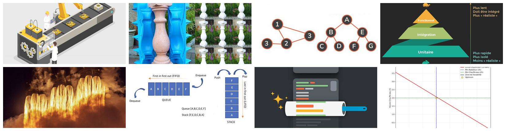

Ce README est produit avec Quarto dans RStudio. Il est compilé en `format: gfm` (GitHub Flavored Markdown).

Il est aussi compilé en `format: html`. C’est la version téléchargeable dans les fichiers, plus haut. Le format HTML comporte entre autres une table des matières flottante pour naviguer dans le document, des numéros de ligne dans les blocs de code et des icônes de ‘copie’ pour copier un bloc de code rapidement.

# Synthèse

| Cas | Programmation | Description |  |
|:---|:---|:---|:---|
| 1 | [Fonctionnelle](#cas-1-programmation-fonctionnelle) | Laisser l’approche classique avec boucle `for` pour l’approche fonctionnelle avec fonctions et pipeline (comme une chaine de montage). |  |
| 2 | [Orientée Objet](#cas-2-programmation-orientée-objet) | Classe, constructeur (moule), instance (objets), attributs, méthodes, module personnel, paquet de modules. | 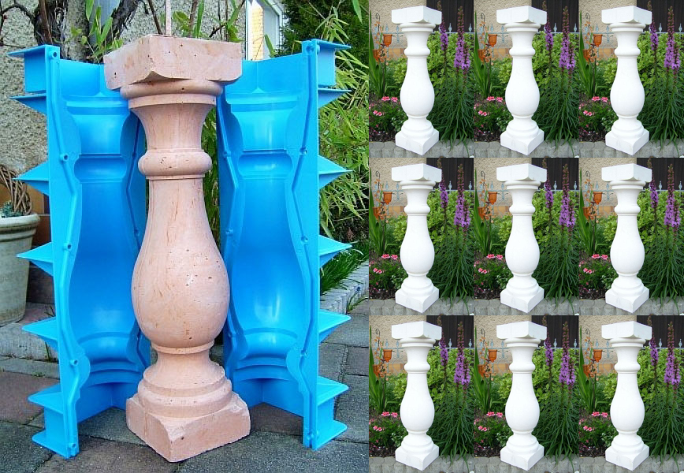 |
| 3 | [Défensive](#cas-3-programmation-défensive) | Typage (mypy) et linting du PEP 8 (flake8, Pylint). |  |
| 4 | [Tests](#cas-4-tests) | Tests unitaires (pytest), tests d’intégration (doctest et pytest), documentation (doctest, MkDocs, mkdocstrings), débogage (pdb). |  |
| 5 | [Exécution Accélérée](#cas-5-exécution-accélérée) | Numba, Cython, Mojo. |  |
| 6 | [Algorithmique Linéaire](#cas-6-programmation-algorithmique-linéaire) | Décorateurs (functools), récursivité, file (queue), pile (stack), pile d’exécution. | 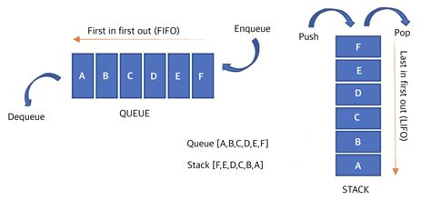 |
| 7 | [Algorithmique Complexe](#cas-7-programmation-algorithmique-complexe) | Décorateurs (functools), récursivité, arbre, graphes, insertion, suppression, recherche, tri. | 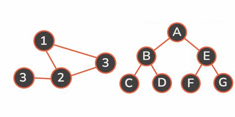 |
| 8 | [Linéaire](#cas-8-programmation-linéaire) | Optimisation sous contrainte (PuLP, MIP). | 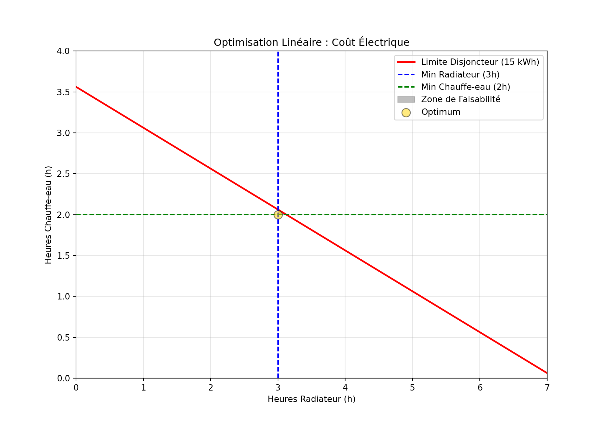 |

# Cas 1, Programmation Fonctionnelle

|                                                 |
|:------------------------------------------------|
| **Retour en haut, à la [Synthèse](#synthèse).** |

Dans ce cas, la Programmation Fonctionnelle permet de traiter des problèmes…

- de CSV (dates inversées),
- de sécurité (calcul de charge de 1750W)
- ou autres

…comme une **chaine de montage** industrielle.


Chaque ouvrier (une fonction) fait sa tâche.

## Pipeline natif

### Importer les modules.

``` python
import datetime
```

### Créer les données

``` python
data = [
    {'appareil': 'Airfryer', 'puissance': '1750W', 'date': '01/12/2024'}, # Inversé ?
    {'appareil': 'Four', 'puissance': '1400W', 'date': '15/11/2024'},    # Correct
    {'appareil': 'Cafetière', 'puissance': '900W', 'date': '05/10/2024'}  # Inversé ?
]
```

### Créer les fonctions

Pas de boucle `for` ni de listes ni de méthode `append()`, mais des fonctions à enchainer.

``` python
def clean_power(record):
    """
    Nettoyer la puissance.
    """
    watts = int(record['puissance'].replace('W', ''))
    return {**record, 'puissance': watts}

def fix_date(record):
    """
    Corriger l'inversion jour/mois.
    """
    d, m, y = map(int, record['date'].split('/'))
    # Si le jour est <= 12, on suspecte une inversion et on échange
    if d <= 12:
        corrected_date = f"{m:02d}/{d:02d}/{y}"
    else:
        corrected_date = record['date']
    return {**record, 'date': corrected_date}

def is_heavy_load(record):
    """
    Filtrer pour la sécurité (charge élevée > 1000W).
    """
    return record['puissance'] > 1000
```

### Enchainer les fonctions

La chaine de montage de la Programmation Fonctionnelle.

``` python
pipeline = filter(is_heavy_load,
                  map(fix_date, 
                      map(clean_power, data)))

# Convertir en liste
resultat = list(pipeline)
```

Avant et après.

``` python
print(data)

print(resultat)
```

    > [{'appareil': 'Airfryer', 'puissance': '1750W', 'date': '01/12/2024'}, {'appareil': 'Four', 'puissance': '1400W', 'date': '15/11/2024'}, {'appareil': 'Cafetière', 'puissance': '900W', 'date': '05/10/2024'}]
    > [{'appareil': 'Airfryer', 'puissance': 1750, 'date': '12/01/2024'}, {'appareil': 'Four', 'puissance': 1400, 'date': '15/11/2024'}]

## Pipeline Pandas

Avec `filter()` et `map()`, il faut imbriquer les fonctions : `filter(fcn, map(fcn, map(fcn, data)))`. Avec beaucoup de fonctions, l’écriture s’alourdit.

Pandas permet d’enchainer les méthodes facilement : `objet.méthode().méthode()`… Chaque méthode fait un calcul. La méthode en cours ingère le résultat de la méthode précédente et alimente la méthode suivante.

Cependant, il faut réécrire le code à la Pandas.

### Importer les modules

``` python
import pandas as pd  # qui inclut datetime
```

### Créer les données

``` python
data = [
    {'appareil': 'Airfryer', 'puissance': '1750W', 'date': '01/12/2024'}, # Inversé ?
    {'appareil': 'Four', 'puissance': '1400W', 'date': '15/11/2024'},    # Correct
    {'appareil': 'Cafetière', 'puissance': '900W', 'date': '05/10/2024'}  # Inversé ?
]

df_data = pd.DataFrame(data)
```

``` python
print(df_data)
```

    >     appareil puissance        date
    > 0   Airfryer     1750W  01/12/2024
    > 1       Four     1400W  15/11/2024
    > 2  Cafetière      900W  05/10/2024

### Créer les fonctions

Avec le comparatif : natif vs Pandas.

``` python
def clean_power(record):
    """
    Nettoyer la puissance.
    """
    watts = int(record['puissance'].replace('W', ''))
    return {**record, 'puissance': watts}

def clean_power_df(df):
    """
    Nettoyer la puissance.
    """
    df = df.copy()
    df['puissance'] = df['puissance'].str.replace('W', '').astype(int)
    return df

###
def fix_date(record):
    """
    Corriger l'inversion jour/mois.
    """
    d, m, y = map(int, record['date'].split('/'))
    # Si le jour est <= 12, on suspecte une inversion et on échange
    if d <= 12:
        corrected_date = f"{m:02d}/{d:02d}/{y}"
    else:
        corrected_date = record['date']
    return {**record, 'date': corrected_date}

def fix_date_df(df):
    """
    Corriger l'inversion jour/mois.
    """
    df = df.copy()
    # Transformer en datetime pour manipuler facilement
    temp_date = pd.to_datetime(df['date'], dayfirst=True)
    
    # Si le jour est <= 12, on suspecte une inversion et on échange
    def logic(d_str):
        d, m, y = map(int, d_str.split('/'))
        return f"{m:02d}/{d:02d}/{y}" if d <= 12 else d_str
    
    df['date'] = df['date'].apply(logic)
    return df

###
def is_heavy_load(record):
    """
    Filtrer pour la sécurité (charge élevée > 1000W).
    """
    return record['puissance'] > 1000

def is_heavy_load_df(df):
    """
    Filtrer pour la sécurité (charge élevée > 1000W).
    """
    return df[df['puissance'] > 1000]
```

### Enchainer les fonctions

`objet.méthode().méthode()`…

``` python
df_final = (
    df_data
    .pipe(clean_power_df)
    .pipe(fix_date_df)
    .pipe(is_heavy_load_df)
)
```

Avant et après.

``` python
print(df_data)

print(df_final)
```

    >     appareil puissance        date
    > 0   Airfryer     1750W  01/12/2024
    > 1       Four     1400W  15/11/2024
    > 2  Cafetière      900W  05/10/2024
    >    appareil  puissance        date
    > 0  Airfryer       1750  12/01/2024
    > 1      Four       1400  15/11/2024

### Simplifier au maximum

Invoquer une fonction devient facultatif avec les méthodes Pandas et l’injection de fonctions lambda.

``` python
df_final = (
    df_data.rename(columns={'old': 'new'})
    .assign(puissance_W = lambda x: x['puissance']\
    .str.replace('W', '').astype(int))
    .query('puissance_W > 1000')
    .sort_values(by='date')
)
```

Avant et après.

``` python
print(df_data)

print(df_final)
```

    >     appareil puissance        date
    > 0   Airfryer     1750W  01/12/2024
    > 1       Four     1400W  15/11/2024
    > 2  Cafetière      900W  05/10/2024
    >    appareil puissance        date  puissance_W
    > 0  Airfryer     1750W  01/12/2024         1750
    > 1      Four     1400W  15/11/2024         1400

## Conclusion

La Programmation Fonctionnelle est utile en Data Science pour créer, par exemple, un pipeline de traitement de type **ETL** (Extract-Transform-Load) qui importe des données, les transforme et les sauvegarde. En Machine Learning, le **processus du MLOps**, du prétraitement, à l’entrainement, au raffinement, à l’analyse est aussi un pipeline.

# Cas 2, Programmation Orientée Objet

|                                                 |
|:------------------------------------------------|
| **Retour en haut, à la [Synthèse](#synthèse).** |

Dans ce cas, la Programmation Orientée Objet permet de **créer un moule** (la classe) pour **fabriquer des objets** (les instances).


## Créer le moule


### Classe parent

``` python
class AppareilElectrique:
    """
    Classe parent.
    """
    
    # Constantes de classe
    # partagées par tous les objet de la classe
    VOLTAGE_STANDARD = 120
    LIMITE_SECURITE_AMPERE = 15.0

    def __init__(self, nom, watts):
        """
        Constructeur avec attributs d'instance.
        """
        self.nom = nom
        self.watts = watts
        # Constante d'instance
        # spécifique à cet objet précis de la classe
        self.id_appareil = f"ID-{nom.upper()}"

    def calculer_amperage(self):
        """
        Méthode.
        """
        return self.watts / self.VOLTAGE_STANDARD

    def verifier_securite(self):
        """
        Méthode.
        """
        amp = self.calculer_amperage()
        if amp > self.LIMITE_SECURITE_AMPERE:
            return "DANGER : Risque de surcharge !"
        return "Sécuritaire pour un circuit standard."

    def consigne_cuisson(self):
        """
        Méthode.
        """
        return "Suivre les instructions du manuel."
```

### Classes enfants

Une classe enfant hérite de la classe parent (héritage).

``` python
class AirFryer(AppareilElectrique):
    """
    Classe enfant.
    La classe AirFryer hérite de la classe AppareilElectrique.
    """
    
    def __init__(self, nom, watts, capacite_litres):
        """
        Constructeur avec attributs d'instance.
        """
        # Invoquer le constructeur du parent
        super().__init__(nom, watts)
        self.capacite = capacite_litres

    # Polymorphisme
    # Changer le comportement d'une méthode du parent
    def consigne_cuisson(self):
        """
        Méthode.
        """
        return "Règle d'or : réduire le temps de 20% et la température de 20°C d'une recette au four."
```

``` python
class Four(AppareilElectrique):
    """
    Classe enfant.
    La classe Four hérite de la classe AppareilElectrique.
    """

    # Polymorphisme
    # Changer le comportement d'une méthode du parent
    def consigne_cuisson(self):
        """
        Méthode.
        """
        return "Préchauffer pendant au moins 5 minutes."
```

## Fabriquer les objets

Utiliser les moules (les constructeurs) pour fabriquer les objets (les instances).


``` python
mon_af = AirFryer("AF161", 1750, 5.2)
mon_four = Four("Four134", 1400)
```

``` python
print(mon_af)
```

    > <__main__.AirFryer object at 0x7eccc4ae56a0>

``` python
appareils = [mon_af, mon_four]

for app in appareils:
    print(f"--- {app.nom} ({app.id_appareil}) ---")
    print(f"Intensité : {app.calculer_amperage():.2f} A")
    print(f"Sécurité : {app.verifier_securite()}")
    print(f"Consigne : {app.consigne_cuisson()}")
```

    > --- AF161 (ID-AF161) ---
    > Intensité : 14.58 A
    > Sécurité : Sécuritaire pour un circuit standard.
    > Consigne : Règle d'or : réduire le temps de 20% et la température de 20°C d'une recette au four.
    > --- Four134 (ID-FOUR134) ---
    > Intensité : 11.67 A
    > Sécurité : Sécuritaire pour un circuit standard.
    > Consigne : Préchauffer pendant au moins 5 minutes.

## Conclusion

La création du moule est la préparation à la production de masse d’objets. C’est plus efficace que de créer des objets un par un.

Les cas abondent. Imaginons la création d’une calculatrice (un petit logiciel). Cette calculatrice compte de nombreux boutons.

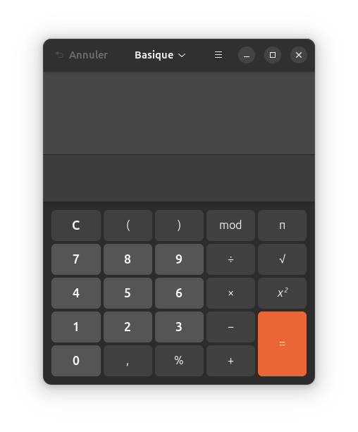

Il serait inefficace de créer chaque bouton un à un. Il faut plutôt créer une classe qui permette de fabriquer différents boutons et de leur assigner des attributs : largeur x, hauteur y, position x-y dans la grille, couleur de fond, couleur du texte, texte, fonction mathématique à invoquer, etc.

La Programmation Orientée Objet est utile en Machine Learning pour **créer un moule de modèle** (classe) qui permet de **fabriquer toutes sortes de variations du modèle** (instances) en changeant les paramètres.

# Cas 3, Programmation Défensive

|                                                 |
|:------------------------------------------------|
| **Retour en haut, à la [Synthèse](#synthèse).** |

Dans ce cas, la Programmation Défensive permet d’écrire du code qui refuse de planter, même si on lui donne de mauvaises données, grâce au **typage** et au **linting** du PEP 8.


## Code sans protection

``` python
def verifier_prise(appareils, limite):
    total = sum(a for a in appareils)
    # Formule : Watts / Volts = Amps
    return total / 120, total / 120 <= limite
```

Utiliser le code.

``` python
wattage = [1750, 1400, 900]  # Watts des appareils sur le secteur
amperage = 15  # Ampères du secteur

print("La prise reçoit un wattage\nqui respecte la limite du secteur (True) :\n", verifier_prise(appareils = wattage, limite = amperage))
```

    > La prise reçoit un wattage
    > qui respecte la limite du secteur (True) :
    >  (33.75, False)

``` python
wattage = [1750]
amperage = 15

print("La prise reçoit un wattage\nqui respecte la limite du secteur (True) :\n", verifier_prise(appareils = wattage, limite = amperage))
```

    > La prise reçoit un wattage
    > qui respecte la limite du secteur (True) :
    >  (14.583333333333334, True)

### Problèmes

- Que se passe-t-il si appareils est une liste vide ?
- Si limite est une chaine de caractères ?
- Si un objet dans la liste n’a pas d’attribut watts ?
- Le programme plante.
- etc.

## Typage

### Importer les modules

Sélectionner quelques types.

``` python
from typing import List, Tuple, Final, Union
```

### Protéger le code

``` python
# Créer une constante non modifiable
VOLTAGE: Final[int] = 120  # Volts

# Typer les argument et la sortie (->)
# Ajouter un docstring
def verifier_prise(
    appareils: List[Union[int, float]], 
    limite: float
) -> Tuple[float, bool]:
    """
    Calculer l'ampérage total et vérifie s'il respecte la limite du disjoncteur.
    
    Args:
        appareils: Une liste des puissances en Watts.
        limite: La limite d'ampérage (ex: 15.0).
        
    Returns:
        Un tuple contenant (Ampérage calculé, Est-ce sécuritaire).
    """
    # Faire une vérification défensive immédiate
    if not appareils:
        return 0.0, True
    
    # Sécuriser le calcul
    # S'assurer que le total est traité comme un float pour la précision
    total_watts: float = float(sum(appareils))
    
    amperage: float = total_watts / VOLTAGE
    est_securitaire: bool = amperage <= limite
    
    return round(amperage, 2), est_securitaire
```

Le typage peut être partiel ou erroné, mais il n’empêche pas le code de s’exécuter.

Utiliser le code.

``` python
wattage = [1750, 1400, 900]  # Watts des appareils sur le secteur
amperage = 15  # Ampères du secteur

print("La prise reçoit un wattage\nqui respecte la limite du secteur (True) :\n", verifier_prise(appareils = wattage, limite = amperage))
```

    > La prise reçoit un wattage
    > qui respecte la limite du secteur (True) :
    >  (33.75, False)

``` python
wattage = [1750]
amperage = 15

print("La prise reçoit un wattage\nqui respecte la limite du secteur (True) :\n", verifier_prise(appareils = wattage, limite = amperage))
```

    > La prise reçoit un wattage
    > qui respecte la limite du secteur (True) :
    >  (14.58, True)

### mypy

Le module mypy permet de valider le code typé sans l’exécuter.

Il faut sauvegarder le code dans un code source et lancer dans un terminal : `mypy mon_script.py`. Ce qui donne :

    Success: no issues found in 1 source file

Sinon, les erreurs sont identifiées (numéro de ligne et type). On apporte les corrections et on relance la validation.

## Linting

### flake8

Le module flake8 permet de vérifier que le code respecte la norme PEP 8 sans exécuter ce code. C’est un linter.

Il faut sauvegarder le code dans un code source et lancer dans un terminal : `flake8 mon_script.py`. Ce qui donne :

    cas_3.py:8:1: E302 expected 2 blank lines, found 1
    cas_3.py:9:40: W291 trailing whitespace
    cas_3.py:13:80: E501 line too long (80 > 79 characters)
    cas_3.py:14:1: W293 blank line contains whitespace
    cas_3.py:18:1: W293 blank line contains whitespace
    cas_3.py:25:1: W293 blank line contains whitespace
    cas_3.py:29:1: W293 blank line contains whitespace
    cas_3.py:32:1: W293 blank line contains whitespace

Les erreurs sont identifiées (numéro de ligne, position dans la ligne et type). On apporte les corrections et on relance la validation.

### Pylint

Le module Pylint est un linter plus sévère que le module flake8, car il analyse aussi la qualité logique du code source.

Il faut sauvegarder le code dans un code source et lancer dans un terminal : `pylint mon_script.py`. Ce qui donne :

    ************* Module cas_3
    cas_3.py:9:39: C0303: Trailing whitespace (trailing-whitespace)
    cas_3.py:25:0: C0303: Trailing whitespace (trailing-whitespace)
    cas_3.py:29:0: C0303: Trailing whitespace (trailing-whitespace)
    cas_3.py:32:0: C0303: Trailing whitespace (trailing-whitespace)
    cas_3.py:1:0: C0114: Missing module docstring (missing-module-docstring)

    -----------------------------------
    Your code has been rated at 4.44/10

Les erreurs sont identifiées (numéro de ligne, position dans la ligne et type). On apporte les corrections et on relance la validation.

## Conclusion

La Programmation Défensive est utile en Data Science et Machine Learning.

Le typage solidifie le code et ouvre la voie à l’**exécution accélérée** de codes sources (abordé plus loin). Par exemple, exécuter un code source Python dans un kernel **Mojo** est beaucoup plus rapide, mais exécuter un code source Python typé dans un kernel Mojo est encore plus rapide.

En équipe, le linting est crucial pour standardiser le **travail d’équipe**. Le code standardisé est plus lisible pour chacun, facile à déléguer, à inspecter et moins prône aux erreurs.

# Cas 4, Tests

|                                                 |
|:------------------------------------------------|
| **Retour en haut, à la [Synthèse](#synthèse).** |

Dans ce cas, les **Tests Unitaires** vérifient que chaque unité du programme (comme une fonction) se comporte exactement comme prévu.

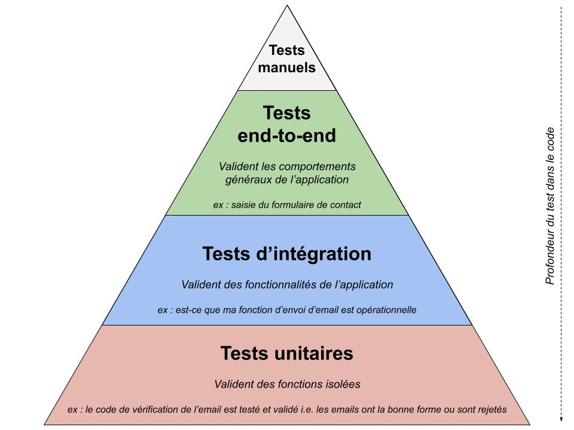

Les Tests Unitaires sont à la base d’un plan complet de tests. On teste les unités : les fonctions. Ensuite, les **Tests d’Intégration** valident l’intégration des unités, les séquences de fonctions. Finalement, les Tests Fonctionnels (end-to-end) valident le fonctionnement du programme complet. Ces derniers tests ne sont pas abordés.

Avant les tests, durant le développement, si le code ne fonctionne pas, il faut **déboguer**.

## Code source à tester

‘electricite.py’

Le code comprend aussi des doctests pour les Tests d’Intégration ; discutés plus loin.

``` python
def verifier_prise(appareils, limite=15.0):
    """
    Calcule l'ampérage total et vérifie la sécurité.

    Exemples de doctest:
    >>> verifier_prise([1200, 600])
    (15.0, True)

    >>> verifier_prise([1750, 1400], 15.0)
    (26.25, False)

    >>> verifier_prise([], 15.0)
    (0.0, True)
    """    
    if not appareils:
        return 0.0, True
    amperage = sum(appareils) / 120
    return round(amperage, 2), amperage <= limite
```

## Code source de test

‘test_electricite.py’

Le code contient les tests unitaires du code source ‘electricite.py’.

Un bon test unitaire suit toujours cette structure :

- Arrange (Préparer) : définir les données d’entrée.
- Act (Agir) : invoquer la fonction que l’on veut tester.
- Assert (Affirmer) : vérifier que le résultat est identique à ce qu’on attendait.

``` python
# Importer le module de test
import pytest

# Importer le code source à tester
from electricite import verifier_prise

def test_charge_securitaire():
    # Arrange
    watts = [900, 600] # Total 1500W / 120V = 12.5A
    
    # Act
    amp, est_ok = verifier_prise(watts)
    
    # Assert
    assert amp == 12.5
    assert est_ok is True

def test_surcharge_airfryer():
    # Arrange
    # Act
    amp, est_ok = verifier_prise([1750])
    
    # Assert
    assert amp == 14.58
    assert est_ok is True # C'est juste sous la limite de 15A

def test_surcharge_multiple():
    # Arrange
    # Act
    amp, est_ok = verifier_prise([1750, 1400])
    
    # Assert
    assert est_ok is False

def test_liste_vide():
    # Arrange
    # Act
    amp, est_ok = verifier_prise([])
    
    # Assert
    assert amp == 0.0
    assert est_ok is True
```

## Contrôler le répertoire de travail

Maintenir tous les fichiers dans le même dossier.

``` python
import os

os.chdir('/home/usr/dossier')

os.getcwd()
```

## pytest

Pour les Tests Unitaires, de nouveaux modules ont vu le jour pour corriger les lacunes du module unittest. Le module pytest s’est démarqué.

Il faut se positionner dans le dossier du projet qui contient les deux fichiers : ‘electricite.py’ et ‘test_electricite.py’.

On lance les tests dans un terminal : `pytest -v`. La commande déclenche tous les fichiers débutant par ‘test\_’ ou finissant avec ’\_test’. Ce qui donne (vue élaguée) :

    ============================= test session starts ==============================
    ...
    cachedir: .pytest_cache
    ...
    plugins: anyio-4.7.0
    collected 4 items                                                              

    test_electricite.py::test_charge_securitaire PASSED                      [ 25%]
    test_electricite.py::test_surcharge_airfryer PASSED                      [ 50%]
    test_electricite.py::test_surcharge_multiple PASSED                      [ 75%]
    test_electricite.py::test_liste_vide PASSED                              [100%]

    ============================== 4 passed in 0.02s ===============================

On lance les tests d’un seul fichier dans un terminal : `pytest test_electricite.py -v`.

Ce n’est qu’un aperçu des possibilités de pytest. Il existe toute sorte de flags comme `-v` (verbose) afin de contrôler les tests, de produire des rapports, d’organiser un projet, etc.

## doctest

Le module doctest peut faire des Tests Unitaires et des Tests d’Inégration. Pour les unités, on préfère pytest à doctest. Or, pytest permet aussi d’exécuter les doctests.

On lance les tests dans un terminal : `pytest --doctest-modules -v`. La commande déclenche tous les fichiers débutant par ‘test\_’ ou finissant avec ’\_test’. La commande repère aussi les doctests et les exécute. Ce qui donne un rapport de tous les tests. Pour ne voir que les doctests, il faut procéder par fichier.

On lance les doctests d’un seul fichier dans un terminal : `pytest --doctest-modules electricite.py -v`. Ce qui donne (vue élarguée) :

    ============================= test session starts ==============================
    ...
    ...
    plugins: anyio-4.7.0, cov-7.0.0
    collected 1 item                                                               

    electricite.py .                                                         [100%]

    ============================== 1 passed in 0.02s ===============================

Comme il n’y a qu’une fonction, il est impossible de démonter un Test d’Intégration qui combine deux fonctions, par exemple.

## Documentation

L’autre attrait du module doctest est de générer une documentation technique.

On génère la documentation d’un seul fichier dans un terminal : `python -m pydoc -w electricite`. Ce qui donne un fichier HTML :

------------------------------------------------------------------------

<html lang="en">

<head>

<meta charset="utf-8">

<title>

Python: module electricite
</title>

</head>

<body>

<table class="heading">

<tr class="heading-text decor">

<td class="title">

 <br><strong class="title">electricite</strong>
</td>

</tr>

</table>

<table class="section">

<tr class="decor functions-decor heading-text">

<td class="section-title" colspan="3">

 <br><strong class="bigsection">Functions</strong>
</td>

</tr>

<tr>

<td class="decor functions-decor">

<span class="code">      </span>
</td>

<td>

 
</td>

<td class="singlecolumn">

<dl>

<dt>

<a name="-verifier_prise"><strong>verifier_prise</strong></a>(appareils, limite=15.0)
</dt>

<dd>

<span class="code">Calcule l’ampérage total et vérifie la sécurité.<br>  <br> Exemples de doctest:<br> \>\>\> <a href="#-verifier_prise">verifier_prise</a>(\[1200, 600\])<br> (15.0, True)<br>  <br> \>\>\> <a href="#-verifier_prise">verifier_prise</a>(\[1750, 1400\], 15.0)<br> (26.25, False)<br>  <br> \>\>\> <a href="#-verifier_prise">verifier_prise</a>(\[\], 15.0)<br> (0.0, True)</span>
</dd>

</dl>

</td>

</tr>

</table>

</body>

</html>

------------------------------------------------------------------------

La documentation austère se limite aux docstrings et aux doctests. C’est un look qui date des années 1990s.

Le projet [MkDocs](https://www.mkdocs.org/) avec le module mkdocstrings automatise la création d’une documentation. La configuration est simple et le résultat donne une documentation HTML au look moderne basée sur le Markdown. Le langage Markdown est répandu. Il existe plusieurs thèmes à MkDocs dont [Material](https://squidfunk.github.io/mkdocs-material/).

Il reste à publier cette documentation sur un service comme GitHub ou GitLab.

La dernière approche est plus simple que celle avec Sphinx qui fonctionne avec son langage. Par contre, Sphinx donne plusieurs formats : HTML, PDF et ebook.

## Autres tests


Les Tests Fonctionnels (end-to-end) sont destinés à vérifier que le comportement fonctionnel de l’application soit conforme à la spécification en simulant les actions de l’utilisateur de manière automatique.

## Déboguer

Les tests sont une preuve de travail.

Avant les tests, durant le développement, si le code ne fonctionne pas, il faut déboguer.

L’approche simple est la technique du `print()` pour contrôler le flux du code.

L’approche complète est le débogueur de Python : le module pdb. Il est aussi intégré dans les EDI. Ce site web l’utilise pour mieux comprendre l’exécution du code :

https://pythontutor.com/visualize.html#mode=edit

L’utilité principale de pdb est d’arrêter le temps pendant l’exécution du code pour inspecter ce qui se passe “sous le capot”.

On utilise la fonction `breakpoint()` comme **point d’arrêt**. Par exemple :

``` python
def traiter_donnees(row):
    breakpoint()  # On suspecte un problème ici
    resultat = float(row['puissance']) / 120
    return resultat

print(traiter_donnees({'puissance': 1500}))
```

Les EDI proposent l’ajout de **points d’arrêt** graphiques et temporaires dans la bordure des lignes de code.

On exécute le code et ce dernier stoppe aux points d’arrêt. Une fois que pdb a mis le programme en pause, on utilise des commandes d’une seule lettre pour se déplacer dans le flux d’exécution :

- On peut tester des hypothèses. Si vous pensez que l’erreur vient du voltage, vous pouvez taper voltage = 240 en plein milieu de la pause et voir comment le reste du programme réagit avec cette nouvelle valeur.
- On peut analyser la pile d’exécution. Si votre fonction plante, vous pouvez remonter avec la commande u (up) pour voir quel fichier et quelle ligne l’a appelée.
- Zéro pollution. Vous n’avez pas besoin de nettoyer 50 lignes de `print()` avant de livrer votre code.

## Conclusion

Les Tests Unitaires peuvent être utile en Data Science et Machine Learning lors de **phases MLOps**.

Les autres tests (intégration et fonctionnels) sont plus facultatifs. Plus le programme se rapproche d’un logiciel ou d’une application, plus les tests sont pertinents.

La maitrise du débogueur permet de gagner du temps lors du développement.

# Cas 5, Exécution Accélérée

|                                                 |
|:------------------------------------------------|
| **Retour en haut, à la [Synthèse](#synthèse).** |

Dans ce cas, l’Exécution Accélérée fait appel à des modules et des ajouts pour accélérer l’exécution du code.


## Numba : le compilateur JIT (Just-In-Time)

- 50x-200x plus rapide que Python.
- Idéal pour les boucles mathématiques et les opérations sur des structures vectorielles et matricielles : ndarray de Numpy et Series et DataFrame de Pandas, par exemple.
- C’est la solution la plus facile à mettre en place.

### Importer les modules

``` python
from numba import njit
import numpy as np
import time
```

### Décorer le code

``` python
@njit  
def somme_complexe_numba(n):
    total = 0
    for i in range(n):
        total += np.sqrt(i)
    return total
```

### Exécuter un code comparatif

``` python
def somme_complexe(n):
    total = 0
    for i in range(n):
        total += np.sqrt(i)
    return total
```

``` python
n = 10000000
start = time.time()
resultat = somme_complexe(n)
stop = time.time()

chrono_code = stop - start

print(f"Résultat: {resultat} calculé en {stop - start:.5f}s")
```

    > Résultat: 21081849486.439312 calculé en 13.33709s

### Exécuter

Exécuter le code pour compiler la fonction en code machine ultrarapide dans la RAM. Cette compilation est temporaire. Il faut recompiler suivant chaque redémarrage de session.

``` python
n = 10000000
start = time.time()
resultat_numba = somme_complexe_numba(n)
stop = time.time()

chrono_numba = stop - start

print(f"Résultat : {resultat_numba} calculé en {stop - start:.5f}s")
```

    > Résultat : 21081849486.439312 calculé en 0.39976s

## Cython : le pont entre Python et C

- 100x-500x plus rapide que Python. On peut atteindre des vitesses proches du C pur.
- Idéal pour créer des modules performants ou pour optimiser des algorithmes existants.
- Il existe aussi Jython, le pont entre Python et Java.

### Créer un code source

Créer un code source Cython nommé ‘somme_module.pyx’.

``` c
from libc.math cimport sqrt

cpdef double somme_complexe_cython(int n):
    # On définit les types pour que la boucle tourne en C pur
    cdef int i
    cdef double total = 0.0
    
    for i in range(n):
        total += sqrt(i)
        
    return total
```

### Exécuter dans un notebook

Il faut d’abord activer Cython dans une cellule avec une commande magique.

``` python
%load_ext Cython
```

Le reste de déroule dans une autre cellule.

``` c
%%cython
from libc.math cimport sqrt

cpdef double somme_complexe_cython(int n):
    cdef int i
    cdef double total = 0.0
    for i in range(n):
        total += sqrt(i)
    return total
```

La fonction `somme_complexe_cython` est ensuite disponible partout dans le notebook.

### Exécuter sans notebook

Il faut plus d’étapes et de temps pour mettre la solution en place.

### Contrôler le répertoire de travail

Maintenir tous les fichiers dans le même dossier.

``` python
import os

os.chdir('/home/usr/dossier')

os.getcwd()
```

Il faut se positionner dans le dossier du projet qui contient le fichier ‘somme_module_cython.pyx’.

### Créer un fichier de compilation

Ajouter au dossier un code source Python nommé ‘setup.py’.

``` python
from setuptools import setup
from Cython.Build import cythonize

setup(
    ext_modules = cythonize("codes_sources/somme_module_cython.pyx")
)
```

### Compiler

Il faut se positionner dans le dossier du projet et lancer la compilation dans un terminal : `python setup.py build_ext --inplace`.

Cython traduit le code source ‘somme_module_cython.pyx’ en un fichier de code C : ‘somme_module_cython.c’.

Le compilateur (comme GCC ou MSVC) compile ce code C dans le dossier en un fichier binaire partagé (.so sur Linux/Mac, .pyd sur Windows) : ‘somme_module_cython.cpython-313-x86_64-linux-gnu.so’.

### Exécuter

Importer le module (du sous-répertoire ‘codes_sources’). Ne pas oublier d’ajouter le fichier vide ‘**init**.py’ au sous-répertoire.

``` r
# Uniquement à cause de Reticulate
library(reticulate)
py_run_string("import sys; sys.path.append('/home/ugo/Téléchargements')")
```

``` python
import codes_sources.somme_module_cython
```

Exécuter.

``` python
import time

n = 10_000_000
start = time.time()
# sous-répertoire.module.fonction
resultat = codes_sources.somme_module_cython.somme_complexe_cython(n)
stop = time.time()

chrono_cython = stop - start

print(f"Résultat : {resultat} calculé en {stop - start:.5f}s")
```

    > Résultat : 21081849486.439312 calculé en 0.02481s

Importer seulement la fonction du module (du sous-répertoire ‘codes_sources’).

``` python
from codes_sources.somme_module_cython import somme_complexe_cython
```

``` python
import time

n = 10_000_000
start = time.time()
# fonction
resultat = somme_complexe_cython(n)
stop = time.time()

print(f"Résultat : {resultat} calculé en {stop - start:.5f}s")
```

    > Résultat : 21081849486.439312 calculé en 0.02416s

## Mojo de Modular

- Le langage Mojo est un compromis entre Python et C 35000x plus rapide que Python
- Il est possible d’exécuter un code source Python avec le kernel Mojo.
- Si le code source Python est typé, il s’exécute encore plus rapidement dans avec kernel Mojo.
- Un code Mojo exécuté avec son kernel peut battre en vitesse le C++ sur des boucles mathématiques et des opérations avec des structures vectorielles et matricielles.

### Réécrire le code Python en Mojo

L’exécution la plus rapide est de convertir le code source en Mojo pour l’exécuter avec le kernel Mojo.

``` python
from math import sqrt

# fn est la version de def en Mojo
# Fixer le type de l'argument et de la sortie (->)
fn somme_complexe_mojo(n: Int) -> Float64:
    # Déclarer la variable et fixer le type
    var total: Float64 = 0.0
    
    for i in range(n):
        total += sqrt(Float64(i))
        
    return total

fn main():
    var n = 10_000_000
    var resultat = somme_complexe_mojo(n)
    print("Résultat Mojo:", resultat)
```

## Conclusion

``` python
print(f"Chrono Code :  {chrono_code:.5f}s")
print(f"Chrono Numba :  {chrono_numba:.5f}s")
print(f"Chrono Cython : {chrono_cython:.5f}s")
print(f"Chrono Mojo : ??? (encore plus rapide que Cython)")
```

    > Chrono Code :  13.33709s
    > Chrono Numba :  0.39976s
    > Chrono Cython : 0.02481s
    > Chrono Mojo : ??? (encore plus rapide que Cython)

L’Exécution Accélérée devient utile pour implanter un pipeline de traitement en Data Science.

Numba, Cython et Mojo sont des solutions “**logicielles**” ; tout ce qui touche au langage, à la programmation, aux modules. Il existe des solutions “**matérielles**”.

En Data Science, Pandas est polyvalent. Par la vectorisation, le module est très performant même s’il ne calcule que sur un CPU. Pour encore plus de performance et traiter d’immenses jeux de données, il faut se tourner vers Polars. Le module parallélise les calculs en utilisant tous les CPU disponibles. Les deux modules sont complémentaires.

Ensuite, il existe toute une série de solutions pour calculer sur une grappe de CPU, sur un GPU, sur une grappe de GPU, localement, sur le cloud, etc.

En Machine Learning, les modules qui offrent des arbres de décisions et des modèles d’ensembles sont conçus à la fois pour CPU et GPU. Étant donné la quantité de calculs, les performances sont meilleures sur GPU.

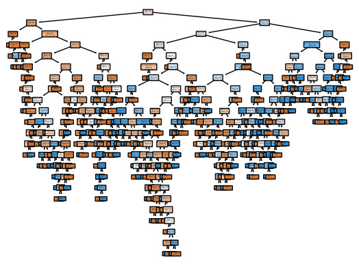

# Cas 6, Programmation Algorithmique Linéaire

|                                                 |
|:------------------------------------------------|
| **Retour en haut, à la [Synthèse](#synthèse).** |

Dans ce cas, la Programmation Algorithmique Linéaire démontre le traitement d’une **file d’attente**.


## La file

Un système reçoit des ordres “Allumer Four”, “Éteindre Airfryer”, etc.

Il faut traiter chaque ordre, un par un jusqu’à ce que la file d’attente soit vide.

La structure de file (queue) est idéale : FIFO, First In, First Out.

|  |  |
|:---|:---|
|  |  |

- `enque()` pour enqueue, `push()`, remplir la file.
- `deque()` pour dequeue, `pop()`, vider la file.

``` python
from collections import deque

file_ordres = deque(["Préchauffer Four",
                     "Démarrer Airfryer",
                     "Vérifier Tension"])

print(f"File du début : {file_ordres}")
```

    > File du début : deque(['Préchauffer Four', 'Démarrer Airfryer', 'Vérifier Tension'])

## Le décorateur

``` python
import functools

def log_traitement(func):
    @functools.wraps(func)
    def wrapper(*args, **kwargs):
        print(f"Décorateur ; début du traitement du lot...")
        resultat = func(*args, **kwargs)
        print(f"Décorateur ; lot terminé.")
        return resultat
    return wrapper
```

## L’algorithme

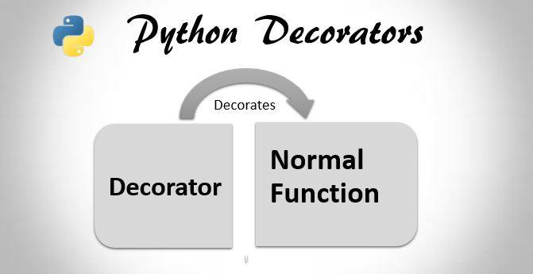

``` python
# Décorer la fonction
# avec le décorateur créé plus haut
@log_traitement
def traiter_file_recursive(file):
    # Si la file est vide, arrêter la récursion
    if not file:
        return
    
    # Retirer le premier élément de la file
    # (FIFO - First In, First Out)
    ordre = file.popleft()
    print(f"  [Action] en cours : {ordre}")
    print(f"File en cours : {file}")
    
    # Traiter le reste de la file
    # Pile d'exécution
    traiter_file_recursive(file)
```


## La pile

Avec le traitement du reste de la file avec `traiter_file_recursive(file)`, chaque appel est empilé dans la **pile d’exécution**. Chaque fois que la fonction s’appelle elle-même, une nouvelle couche est ajoutée sur la pile d’exécution. Avec 1000 éléments, la pile monte de 1000 étages. Ensuite, la pile se vide à partir de la dernière couche.

La structure de pile (stack) est l’inverse de la file : LIFO, Last In, First Out.

|  |  |
|:---|:---|
|  |  |

- `push()`, remplir la pile.
- `pop()`, vider la pile.

## Exécuter

``` python
traiter_file_recursive(file_ordres)
```

    > Décorateur ; début du traitement du lot...
    >   [Action] en cours : Préchauffer Four
    > File en cours : deque(['Démarrer Airfryer', 'Vérifier Tension'])
    > Décorateur ; début du traitement du lot...
    >   [Action] en cours : Démarrer Airfryer
    > File en cours : deque(['Vérifier Tension'])
    > Décorateur ; début du traitement du lot...
    >   [Action] en cours : Vérifier Tension
    > File en cours : deque([])
    > Décorateur ; début du traitement du lot...
    > Décorateur ; lot terminé.
    > Décorateur ; lot terminé.
    > Décorateur ; lot terminé.
    > Décorateur ; lot terminé.

## Conclusion

La **file** et la **pile** sont des structures algorithmiques linéaires ; des séquences. On les retrouve d’ailleurs en Machine Learning.

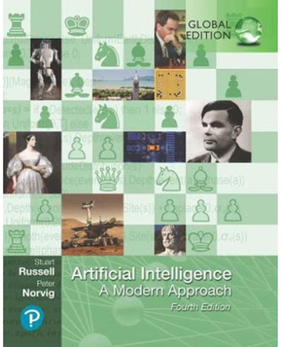

### File

Deux modèles de Machine Learning classique.

DBSCAN (pour le clustering), apprentissage non supervisé. Pour construire un groupe (cluster), l’algorithme commence par un point central et explore tous ses voisins proches. Lorsqu’il trouve des voisins, il les place dans une file. Il extrait ensuite le premier voisin de la file pour chercher à son tour ses propres voisins, et ainsi de suite.

| DBSCAN | Fenêtres glissantes |
|:---|:---|
|  | 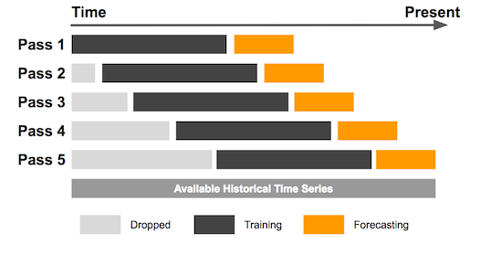 |

Fenêtres glissantes (sliding, rolling windows ; pour les séries chronologiques), apprentissage supervisé. Pour faire des prévisions en fonction des 7 derniers jours, il faut utiliser une file à taille fixe (7 données). Chaque nouveau relevé entre dans la file (push), et le plus ancien en sort (pop).

### Pile

Deux modèles de Machine Learning classique.

Arbres de décision, apprentissage supervisé. La construction d’un arbre de décision de classification pour prédire un état binomial ou multinomial utilise souvent une pile. Pour diviser les données, l’algorithme crée un nœud, puis “empile” la branche de gauche pour la traiter plus tard, pendant qu’il finit d’explorer la branche de droite jusqu’au bout (les feuilles).

| Arbres de décision | Clustering Hiérarchique Agglomératif |
|:---|:---|
|  | 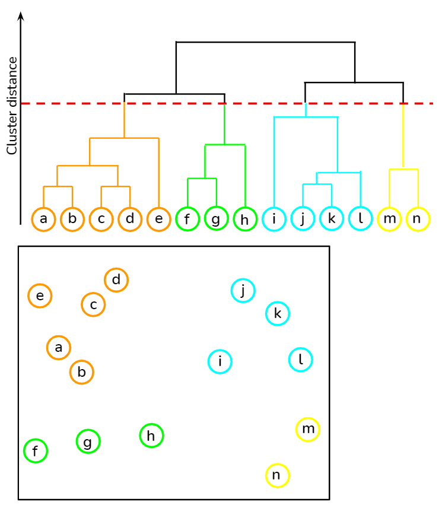 |

Clustering Hiérarchique Agglomératif, apprentissage non supervisé. Pour construire un dendrogramme (un arbre de regroupement), l’algorithme peut utiliser une pile pour parcourir la hiérarchie une fois qu’elle est construite afin de couper l’arbre au bon niveau de clusters.

### Autres

Il existe d’autres structures algorithmiques linéaires avec leurs avantages et inconvénients.

- Liste chainée (chained, linked list) ; une série de nœuds où chaque élément pointe vers le suivant. La liste R.
- Tableau (array) ; une collection d’éléments identifiés par un index, stockés de manière contiguë en mémoire. La liste Python et le vecteur R.

| Liste chainée | Tableau vs Liste chainée |
|:---|:---|
| 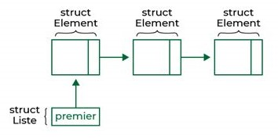 | 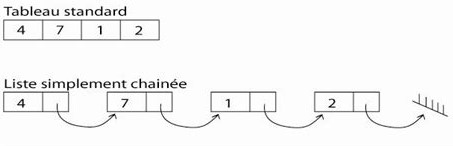 |

| Structure     | Usage courant                                        |
|:--------------|:-----------------------------------------------------|
| File          | Gestion des tâches en attente.                       |
| Pile          | Gestion des appels de fonctions.                     |
| Liste chainée | Stockage, insertion, suppression, extraction rapide. |
| Tableau       | Stockage, insertion, suppression, extraction rapide. |

La structure de la **liste chainée** est mieux connue sous le nom de chaine de blocs ou **blockchain**.

Le tableau est en sorte un vecteur en algèbre matricielle. La combinaison de vecteurs forme des matrices (array). La matrice classique est bidimensionnelle ; le data.frame en R et le DataFrame en Python. La matrice peut être multidimensionnelle. Les **vecteurs** et les **matrices** sont des **tenseurs**. Un module de Deep Learning se nomme TensorFlow (flux de tenseurs).

Toutes ces structures se retrouvent en Machine Learning classique, en Deep Learning, dans les Large Language Models, etc.

# Cas 7, Programmation Algorithmique Complexe

|                                                 |
|:------------------------------------------------|
| **Retour en haut, à la [Synthèse](#synthèse).** |

Dans ce cas, la Programmation Algorithmique Complexe démontre le traitement d’un **arbre** et d’un **graphe**.


Dans le monde de l’électricité, cela correspond à deux réalités :

- L’arbre : un tableau de bord principal qui se divise en sous-disjoncteurs, puis en prises (structure hiérarchique).
- Le graphe : un réseau maillé où l’électricité peut circuler par plusieurs chemins, avec un risque de boucle infinie si on ne fait pas attention.

## L’arbre

L’arbre binomial simule la propagation d’une coupure de courant. Si un disjoncteur “parent” saute, ses deux “enfants” perdent le courant récursivement.

|  |  |
|:---|:---|
| 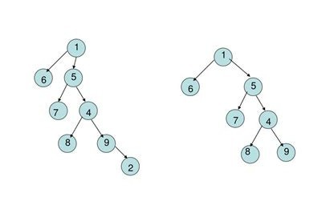 | 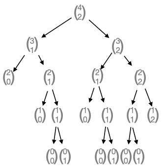 |

### Créer le moule


``` python
class Disjoncteur:
    def __init__(self, nom, gauche=None, droite=None):
        self.nom = nom
        self.gauche = gauche
        self.droite = droite
        self.actif = True

def couper_courant_arbre(noeud):
    """Récursivité sur arbre binomial : Cas de base + 2 appels."""
    if noeud is None:
        return
    
    # Action : Couper le courant sur ce noeud
    print(f"Coupure sur : {noeud.nom}")
    noeud.actif = False
    
    # Appels récursifs sur les deux branches
    # Pile d'exécution
    couper_courant_arbre(noeud.gauche)
    couper_courant_arbre(noeud.droite)
```

### Fabriquer les objets


``` python
# Construction de l'arbre
#         Principal
#        /         \
#    Cuisine      Salon
#    /     \      /    \
# Four   Prise1  TV   Prise2
cuisine = Disjoncteur("Cuisine", Disjoncteur("Four"), Disjoncteur("Prise1"))
salon = Disjoncteur("Salon", Disjoncteur("TV"), Disjoncteur("Prise2"))
principal = Disjoncteur("Principal", cuisine, salon)

print(cuisine)
```

    > <__main__.Disjoncteur object at 0x7eccbdedf250>

``` python
couper_courant_arbre(cuisine)
```

    > Coupure sur : Cuisine
    > Coupure sur : Four
    > Coupure sur : Prise1

``` python
couper_courant_arbre(salon)
```

    > Coupure sur : Salon
    > Coupure sur : TV
    > Coupure sur : Prise2

``` python
couper_courant_arbre(principal)
```

    > Coupure sur : Principal
    > Coupure sur : Cuisine
    > Coupure sur : Four
    > Coupure sur : Prise1
    > Coupure sur : Salon
    > Coupure sur : TV
    > Coupure sur : Prise2

## Le graphe

Le graphe avec cycle représente un réseau intelligent (smart grid). Les lignes peuvent être interconnectées. Si on cherche à vérifier la tension sur tout le réseau par récursion, on risque de tourner en rond pour l’éternité si on ne “marque” pas les endroits déjà visités.

|  |  |
|:---|:---|
| 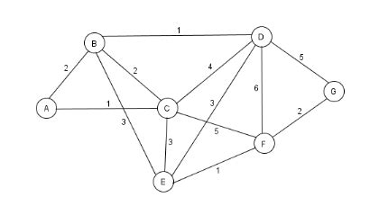 | 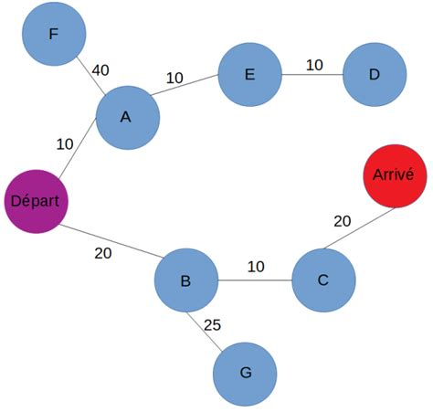 |

### Le décorateur

Suivre les visites et éviter les cycles.

``` python
import functools

def detecteur_de_cycle(func):
    # DFS (Deep First Search)
    visites = set()  # Mémoire des noeuds déjà vus
    @functools.wraps(func)
    def wrapper(noeud_actuel, reseau):
        if noeud_actuel in visites:
            print(f"Cycle détecté sur {noeud_actuel} ! On s'arrête ici.")
            return
        visites.add(noeud_actuel)
        return func(noeud_actuel, reseau)
    return wrapper
```

### L’algorithme


``` python
# Décorer la fonction
# avec le décorateur créé plus haut
@detecteur_de_cycle
def inspecter_reseau(noeud, reseau):
    print(f"Inspection du transformateur : {noeud}")
    
    # Parcourir tous les voisins (connexions) du noeud
    # Pile d'exécution
    for voisin in reseau.get(noeud, []):
        inspecter_reseau(voisin, reseau)
```


### Exécuter

``` python
# Définir un graphe avec un cycle
# A -> B -> C -> A (boucle !)
reseau_electrique = {
    "Transfo_A": ["Transfo_B", "Transfo_D"],
    "Transfo_B": ["Transfo_C"],
    "Transfo_C": ["Transfo_A"],  # ICI : Le cycle qui ferait planter une récursion simple
    "Transfo_D": []
}
```

``` python
inspecter_reseau("Transfo_A", reseau_electrique)
```

    > Inspection du transformateur : Transfo_A
    > Inspection du transformateur : Transfo_B
    > Inspection du transformateur : Transfo_C
    > Cycle détecté sur Transfo_A ! On s'arrête ici.
    > Inspection du transformateur : Transfo_D

## Conclusion

L’**arbre** et le **graphe** sont des structures algorithmiques complexes.

|  |  |
|:---|:---|
|  |  |
|  |  |

| Concept | Arbre binomial | Graphe |
|:---|:---|:---|
| Structure | Hiérarchique (Parent -\> Enfants). | Maillée (N’importe qui -\> N’importe qui). |
| Complexité récursive | Simple (2 appels par fonction). | Risquée (nombre variable d’appels). |
| Condition d’arrêt | Quand le noeud est None. | Quand le noeud est déjà dans l’ensemble de noeuds visités. |
| … | … | … |

|  |  |
|:---|:---|
|  |  |

On les retrouve d’ailleurs en Machine Learning.


### Arbre

Deux modèles de Machine Learning classique.

Isolation Forest (pour la détection d’anomalies), apprentissage non supervisé. Pour détecter une fraude ou une panne, l’algorithme cherche à isoler chaque point anormal. Les points normaux demandent beaucoup de divisions pour être isolés. Les points anormaux (les anomalies) sont isolés très rapidement, près de la racine de l’arbre. Plus un point est “haut” dans l’arbre après isolation, plus il est suspect.

| Isolation Forest | Clustering Hiérarchique Agglomératif |
|:---|:---|
| 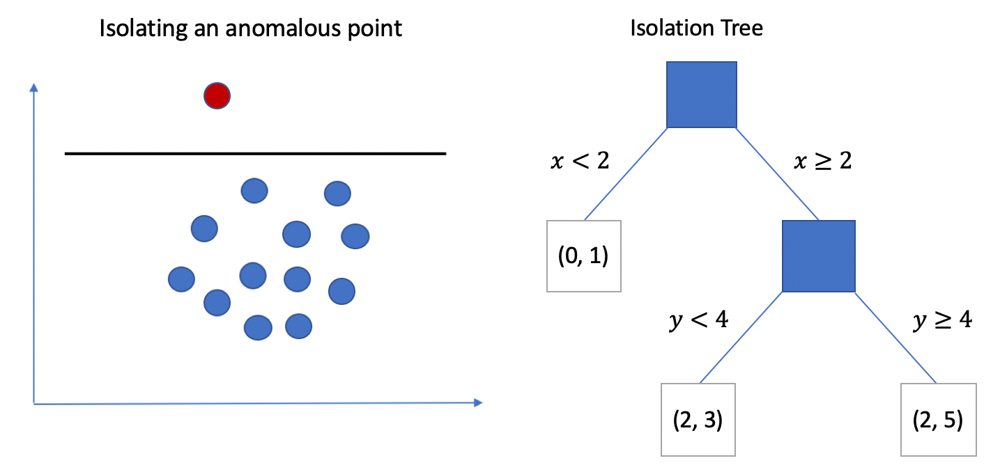 |  |

Clustering Hiérarchique Agglomératif, apprentissage non supervisé. Pour construire un dendrogramme (un arbre de regroupement), l’algorithme peut utiliser une pile pour parcourir la hiérarchie une fois qu’elle est construite afin de couper l’arbre au bon niveau de clusters.

### Graphe

Deux modèles de Machine Learning classique.

Isomap & LLE (pour la réduction de dimensions), apprentissage non supervisé. Pour réduire 50 features (50 colonnes, 50 variables) en 2 dimensions (2 colonnes, 2 variables), l’algorithme crée un “graphe de voisinage”. Chaque point est relié à ses voisins les plus proches. L’algorithme calcule ensuite les distances les plus courtes à travers ce graphe pour comprendre la véritable “forme” (la variété) des données.

| Isomap | Réseaux Bayésiens, DAG |
|:---|:---|
| 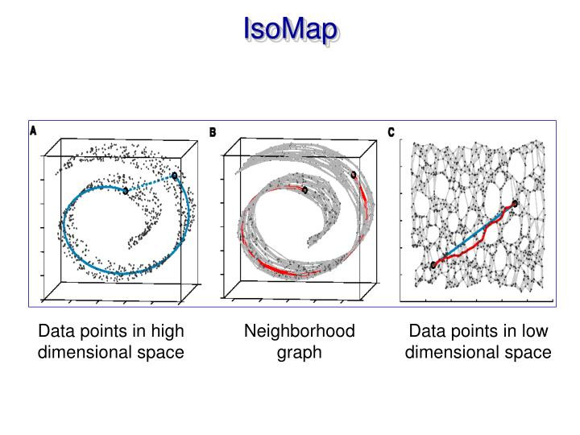 | 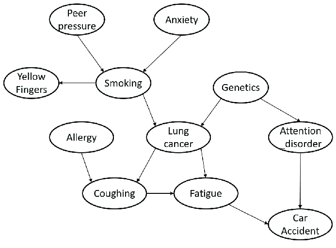 |

Réseaux Bayésiens, apprentissage supervisé. Il est utilisé pour le diagnostic de pannes complexes. Le Graphe Acyclique Dirigé (Directed Acyclic Graph, DAG) représente les dépendances entre les causes et les effets. Un nœud “événement” a une flèche vers une “cause”, qui a une flèche vers un “effet”. En observant l’effet, on remonte le graphe pour calculer la probabilité que la cause soit un événement ou un autre.

### Autres

Il existe d’autres structures algorithmiques complexes avec leurs avantages et inconvénients.

- Tas (heap) ; un arbre spécifique utilisé pour accéder rapidement à l’élément maximum ou minimum.
- Table de hachage, table associative (hash table, hash map) ; une table à deux colonnes qui utilise une clé pour stocker une valeur. Le dictionnaire Python.
- Ensemble (set) ; une collection d’éléments uniques, sans ordre particulier. Les set et frozenset de Python. Les ensembles de l’algèbre de Venn avec les opérateurs logique comme AND, OR, etc. permettent les jointures de table en SQL (inner join, outer join, etc.).

| Table associative | Ensemble |
|:---|:---|
| 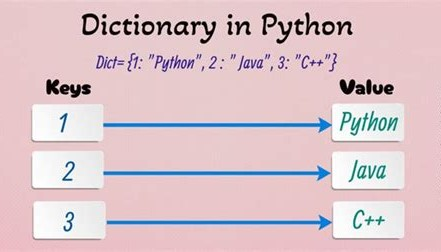 | 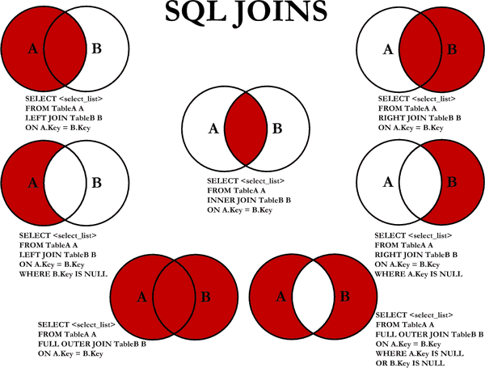 |

| Structure | Usage courant |
|:---|:---|
| Arbre | Bases de données, hiérarchies. |
| Graphe | Réseaux, itinéraires, réseaux neuronaux. |
| Tas | Files de priorité, algorithmes d’ordonnancement. |
| Table de Hachage | Bases de données, systèmes de cache, gestion de configuration. |
| Ensemble | Dédoublonnage, opérations mathématiques, gestion des permissions. |

Toutes ces structures se retrouvent en Machine Learning classique, en Deep Learning, dans les Large Language Models, etc.

# Cas 8, Programmation Linéaire

|                                                 |
|:------------------------------------------------|
| **Retour en haut, à la [Synthèse](#synthèse).** |

Dans ce cas, la Programmation Linéaire démontre comment la programmation permet de prendre des décisions intelligentes en contexte de ressources limitées.


Cette programmation est synonyme d’optimisation sous contrainte et de recherche opérationnelle.

## Problème

**Minimiser le coût** de fonctionnement de trois appareils **sans dépasser une consommation totale** de 15kWh.

Appareils :

- Radiateur (2kW) : minimum 3h par jour.
- Chauffe-eau (4kW) : minimum 2h par jour.
- Airfryer (1.5kW) : minimum 0.5h par jour.

Coût : 0.15\$/kWh.

## Optimiser avec PuLP

PuLP est un module simple de Programmation Linéaire capable de prendre de gros modèles. La syntaxe est extrêmement proche du langage naturel.

``` python
import pulp
```

Poser le problème.

``` python
# Minimiser le coût...
prob = pulp.LpProblem("Optimisation_Cout_Electrique", pulp.LpMinimize)

# Créer des variables
# Wattage pour chaque appareil
w_radiateur = 2  # kW
w_chauffe_eau = 4  # kW
w_airfryer = 1.5  # kW

# Nombre d'heures pour chaque appareil
h_radiateur = pulp.LpVariable("Heures_Radiateur", lowBound=3)  # Min 3h
h_chauffe_eau = pulp.LpVariable("Heures_Chauffe_Eau", lowBound=2)  # Min 2h
h_airfryer = pulp.LpVariable("Heures_Airfryer", lowBound=0.5)  # Min 0.5h

# Coût
c_kWh = 0.15

# Créer la fonction Objectif, la fonction de coût total
# qu'il faut minimiser
# Coût = (Wattage * Heures) * Tarif
prob += (w_radiateur * h_radiateur + w_chauffe_eau * h_chauffe_eau + w_airfryer * h_airfryer) * c_kWh

# Créer une contrainte
# Consommation totale <= 15 kWh
prob += (w_radiateur * h_radiateur + w_chauffe_eau * h_chauffe_eau + w_airfryer * h_airfryer) <= 15
```

Résoudre le problème.

``` python
prob.solve(pulp.PULP_CBC_CMD(msg=0))

if prob.solve(pulp.PULP_CBC_CMD(msg=0)):
    print(f"Statut : {pulp.LpStatus[prob.status]}")
    print(f"- Heures Radiateur : {h_radiateur.varValue:.2f}h")
    print(f"- Heures Chauffe-eau : {h_chauffe_eau.varValue:.2f}h")
    print(f"- Heures Airfryer : {h_airfryer.varValue:.2f}h")
```

    > 1
    > Statut : Optimal
    > - Heures Radiateur : 3.00h
    > - Heures Chauffe-eau : 2.00h
    > - Heures Airfryer : 0.50h

Valider la réponse (Coût total minimal).

``` python
res_pulp = (w_radiateur * h_radiateur.varValue + w_chauffe_eau * h_chauffe_eau.varValue + w_airfryer * h_airfryer.varValue) * c_kWh

print(res_pulp)
```

    > 2.2125

## Visualiser

Préparer le graphique.

Fixer l’Airfryer à sa valeur optimale pour la 2D.

``` python
air_val = h_airfryer.varValue

print(air_val)
```

    > 0.5

Faire varier les deux autres appareils.

``` python
import numpy as np

x = np.linspace(0, 8, 400)  # heures Radiateur
y = np.linspace(0, 5, 400)  # heures Chauffe-eau

import pandas as pd

print(pd.Series(x).describe())
print(pd.Series(y).describe())
```

    > count    400.000000
    > mean       4.000000
    > std        2.318081
    > min        0.000000
    > 25%        2.000000
    > 50%        4.000000
    > 75%        6.000000
    > max        8.000000
    > dtype: float64
    > count    400.000000
    > mean       2.500000
    > std        1.448801
    > min        0.000000
    > 25%        1.250000
    > 50%        2.500000
    > 75%        3.750000
    > max        5.000000
    > dtype: float64

Avec :

- w_radiateur = 2 (kW)
- w_chauffe_eau = 4
- w_airfryer = 1.5

Contraindre la consommation :

w_radiateur \* x + w_chauffe_eau \* y + w_airfryer \* air_val \<= 15

Soit :

y \<= (15 - w_airfryer \* air_val - w_radiateur \* x) / w_chauffe_eau

``` python
y_conso = (15 - w_airfryer * air_val - w_radiateur * x) / w_chauffe_eau

print(pd.Series(y_conso).describe())
```

    > count    400.000000
    > mean       1.562500
    > std        1.159041
    > min       -0.437500
    > 25%        0.562500
    > 50%        1.562500
    > 75%        2.562500
    > max        3.562500
    > dtype: float64

Tracer.

``` python
import matplotlib.pyplot as plt

plt.figure(figsize=(10, 7))

plt.plot(x, y_conso, label='Limite Disjoncteur (15 kWh)', color='red', lw=2)
plt.axvline(3, color='blue', linestyle='--', label='Min Radiateur (3h)')
plt.axhline(2, color='green', linestyle='--', label='Min Chauffe-eau (2h)')

# Remplir de la zone de faisabilité
plt.fill_between(x, 2, np.minimum(y_conso, 5), where=(x >= 3) & (y_conso >= 2), color='gray', alpha=0.5, label='Zone de Faisabilité')

# Ajouter l'optimum
plt.scatter(h_radiateur.varValue, h_chauffe_eau.varValue, color='gold', alpha=0.5, s=100, marker='o', label='Optimum', edgecolor='black', zorder=5)

plt.xlim(0, 7), plt.ylim(0, 4)
plt.xlabel('Heures Radiateur (h)'), plt.ylabel('Heures Chauffe-eau (h)')
plt.title('Optimisation Linéaire : Coût Électrique')
plt.legend(), plt.grid(True, alpha=0.3)

plt.savefig("img/mon_graphique_1.png")

plt.show();
```

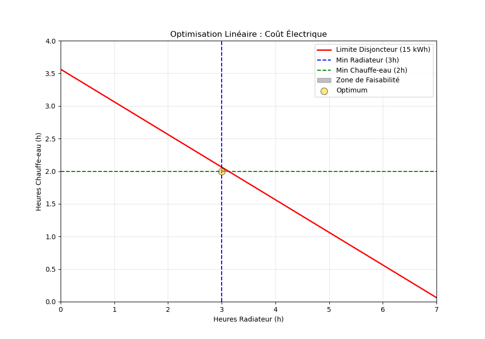

La ligne rouge (Limite Disjoncteur) représente la limite physique des 15 kWh ou la contrainte du problème. Plus on l’approche, en partant de l’origine (0, 0), plus on consomme.

Le cercle (Optimum) se trouve exactement à l’intersection des deux besoins minimums (x=3 et y=2). Pour minimiser le coût, l’algorithme “pousse” la solution le plus bas possible sur y et le plus à gauche possible sur x.

La zone grise (Zone de Faisabilité) est le seul endroit où la solution peut fonctionner. Il faut zoomer.

``` python
import matplotlib.pyplot as plt

plt.figure(figsize=(10, 7))

plt.plot(x, y_conso, label='Limite Disjoncteur (15 kWh)', color='red', lw=2)
plt.axvline(3, color='blue', linestyle='--', label='Min Radiateur (3h)')
plt.axhline(2, color='green', linestyle='--', label='Min Chauffe-eau (2h)')

# Remplir de la zone de faisabilité
plt.fill_between(x, 2, np.minimum(y_conso, 5), where=(x >= 3) & (y_conso >= 2), color='gray', alpha=0.5, label='Zone de Faisabilité')

# Ajouter l'optimum
plt.scatter(h_radiateur.varValue, h_chauffe_eau.varValue, color='gold', alpha=0.5, s=100, marker='o', label='Optimum', edgecolor='black', zorder=5)

plt.xlim(2.5, 3.5), plt.ylim(1.5, 2.5)

plt.savefig("img/mon_graphique_2.png")

plt.show();
```

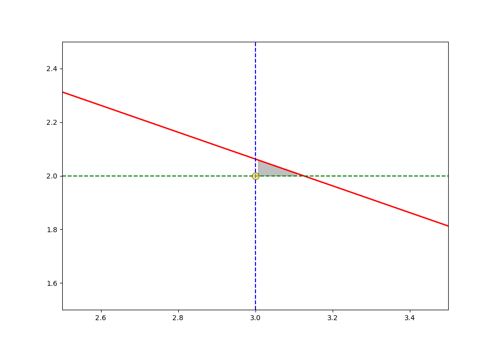

La zone entre le cercle et la ligne rouge représente la marge de sécurité (ou slack). Consommer un peu plus ne fera pas sauter le système.

Évidemment, il y a des problèmes plus complexes avec plus de variables, plus de contraintes, parfois sans optimum ou avec de plus grandes zones de faisabilité.

|  |  |
|:---|:---|
| 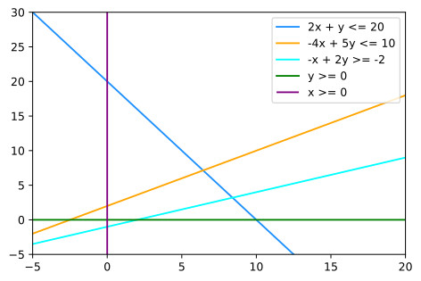 | 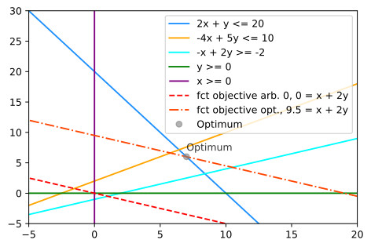 |
| 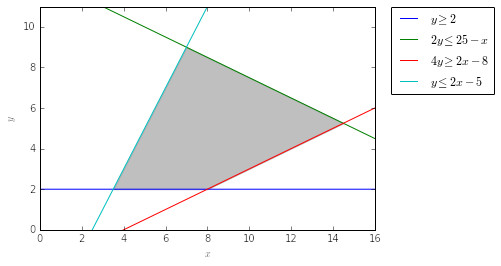 |  |

## Python-MIP

MIP est un module plus puissant de Programmation Mixte pour des problèmes complexes avec des milliers de variables. MIP communique directement avec les bibliothèques C des solveurs ; il évite les temps d’écriture/lecture de fichiers intermédiaires que PuLP doit parfois effectuer.

``` python
from mip import Model, MINIMIZE, CBC
```

Poser le problème.

``` python
# Minimiser le coût...
m = Model(name="Optimisation_Elec", sense=MINIMIZE, solver_name=CBC)

# Créer des variables
# Wattage pour chaque appareil
wt_radiateur = 2  # kW
wt_chauffe_eau = 4  # kW
wt_airfryer = 1.5  # kW

# Nombre d'heures pour chaque appareil
hr_radiateur = m.add_var(name="Heures_Radiateur", lb=3.0)
hr_chauffe_eau = m.add_var(name="Heures_Chauffe_Eau", lb=2.0)
hr_airfryer = m.add_var(name="Heures_Airfryer", lb=0.5)

# Coût
ct_kWh = 0.15

# Créer la fonction Objectif, la fonction de coût total
# qu'il faut minimiser
# Coût = (Wattage * Heures) * Tarif
m.objective = (wt_radiateur * hr_radiateur + wt_chauffe_eau * hr_chauffe_eau + wt_airfryer * hr_airfryer) * ct_kWh

# 4. Ajout de la contrainte de capacité (Max 15 kWh)
m += (wt_radiateur * hr_radiateur + wt_chauffe_eau * hr_chauffe_eau + wt_airfryer * hr_airfryer) <= 15, "Capacite_Max"
```

Résoudre le problème.

``` python
m.optimize()

if m.num_solutions:
    print(f"Statut : {m.status}")
    print(f"Coût total minimal : {m.objective_value:.2f} $")
    print(f"- Heures Radiateur : {hr_radiateur.x:.2f}h")
    print(f"- Heures Chauffe-eau : {hr_chauffe_eau.x:.2f}h")
    print(f"- Heures Airfryer : {hr_airfryer.x:.2f}h")
```

    > Statut : OptimizationStatus.OPTIMAL
    > Coût total minimal : 2.21 $
    > - Heures Radiateur : 3.00h
    > - Heures Chauffe-eau : 2.00h
    > - Heures Airfryer : 0.50h

Comparer à PuLP.

``` python
if prob.solve(pulp.PULP_CBC_CMD(msg=0)):
    print(f"Statut : {pulp.LpStatus[prob.status]}")
    print(f"Coût total minimal : {res_pulp:.2f} $")
    print(f"- Heures Radiateur : {h_radiateur.varValue:.2f}h")
    print(f"- Heures Chauffe-eau : {h_chauffe_eau.varValue:.2f}h")
    print(f"- Heures Airfryer : {h_airfryer.varValue:.2f}h")
```

    > Statut : Optimal
    > Coût total minimal : 2.21 $
    > - Heures Radiateur : 3.00h
    > - Heures Chauffe-eau : 2.00h
    > - Heures Airfryer : 0.50h

## Conclusion

L’optimisation **est un créneau à part entière de l’IA** et le **socle de l’IA** depuis les années 1950s avec les premiers ordinateurs et les premiers calculs informatiques. Par contre, les calculs ne sont pas fondés sur les statistiques et les probabilités comme en Machine Learning, Deep Learning, etc. L’optimisation est le créneau du calcul de pointe, des algorithmes, des heuristiques. Les cas classiques comme le vendeur itinérant et le problème du sac à dos se déclinent en une variété d’applications d’IA en planification, en production, en transport, en comptabilité (maximiser les profits, minimiser les coûts).

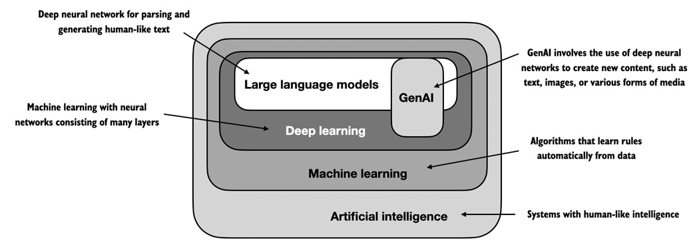

|  |  |
|:---|:---|
| 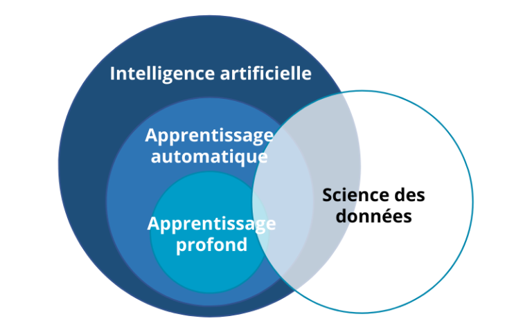 | 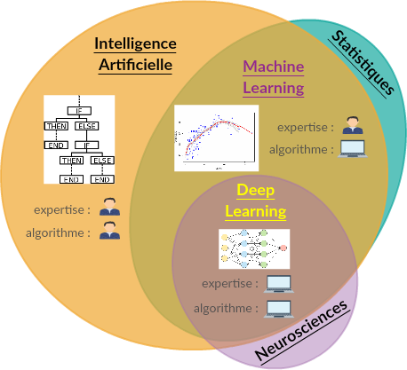 |

L’optimisation est aussi imbriqué dans la Data Science. Par exemple, avec Pandas, les approches pour remplacer les valeurs manquantes par interpolation sont à base d’optimisation. Avec la méthode `pandas.DataFrame.interpolate(method='spline', order=2)`, Pandas (via scipy en arrière-plan) cherche à minimiser la courbure de la ligne tout en passant par les points connus. C’est un problème d’optimisation quadratique sous contraintes. D’autres méthodes comme `cut()` et `qcut()` découpe une distribution de données continues en classes discrètes (binning). L’optimisation divise les données pour maximiser l’équilibre des classes.

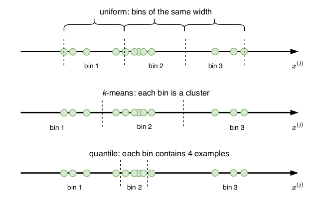

De plus, les heuristiques et les algorithmes **sont au cœur des modules, des modèles** en Data Science et en Machine Learning. Par exemple, avec Scikit-Learn, une des heuristiques itérative du modèle de K-Means (clustering) cherche à maximiser la distance carrée de tous les centroïdes des clusters tout en minimisant la distance carrée entre les points et le centroïde dans chaque cluster. Scikit-Learn offre d’autres heuristiques avec son modèle de K-Means.

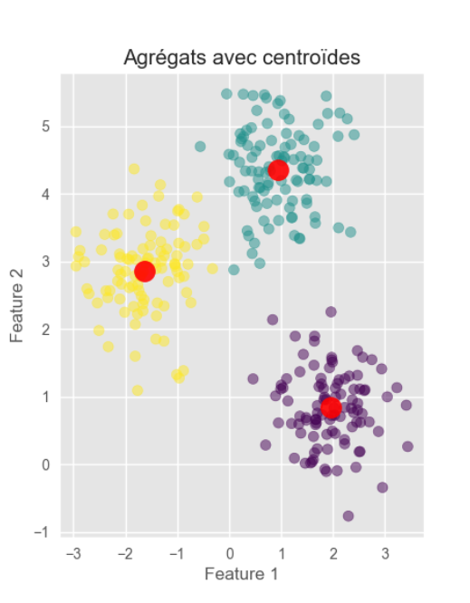
